阅读这篇教程，你需要这些东西：
1. shell基础
2. git
3. maven的管理项目之间的关系

该项目演示通过gitlab、Jenkins、maven、docker实现自动部署。

具体步骤如下：
1. 当gitlab的指定分支（比如：master分支）监听到有代码更新，通过设置webhook地址通知Jenkins。
2. Jenkins拉取gitlab-master分支的代码，联合maven中间件构建Docker镜像，上传到我们自己的DockerHub。
3. Jenkins构建完成（这时候镜像已经存储在我们的DockerHub上面了），连接到部署的机器，关闭老的项目，启动新的项目。

因为是在我自己的电脑上启动相对应的虚拟机进行实现，所以可以说一切从零开始搭建。观看教程的你如果中间哪一步企业已经构建完了，可以利用现有的环境进行稍加配置实现CI自动化部署。

机器分布：

|编号|机器名称|IP|作用|
|----|-----|----|-----|
|1|Gitlab-server|192.168.1.50|用于存放Gitlab服务|
|2|Jenkins-server|192.168.1.53|用于存放Jenkins服务, Docker-registry服务|

## 一. 安装Gitlab环境

### 1. 使用Docker运行Gitlab环境：

```
sudo docker run --detach \
    --hostname gitlab.weidan.com \
    --publish 443:443 --publish 80:80 --publish 22:22 \
    --name gitlab \
    --restart always \
    --volume /srv/gitlab/config:/etc/gitlab \
    --volume /srv/gitlab/logs:/var/log/gitlab \
    --volume /srv/gitlab/data:/var/opt/gitlab \
    gitlab/gitlab-ce:latest
```

### 2. 增加防火墙规则

命令中看到需要几个端口，这时候需要再防火墙开放这几个端口以供Gitlab使用：

```
firewall-cmd --zone=public --add-port=80/tcp --permanent
firewall-cmd --zone=public --add-port=22/tcp --permanent
firewall-cmd --zone=public --add-port=443/tcp --permanent
firewall-cmd --reload
```

### 3. 修改本机hosts

修改本机hosts的方法不同系统是不同的，Windows是在C:/Windows/system32/drivers/etc/hosts，OSX是在/etc/hosts中。
按照我上面定义的hostname去添加，我这里因为ip是192.168.1.50，域名是gitlab.weidan.com
所以在hosts中增加`192.168.1.50 gitlab.weidan.com`即可

### 4. 配置项目

访问`gitlab.weidan.com`，进入页面，第一次进入是需要修改root密码的。修改完成以后可以添加团队、成员等等，现在就用root用户来做测试了。

首先创建一个空项目。

然后使用idea在当前的项目创建一个Git仓库并提交

push到刚刚在gitlab上创建的空项目地址。

（这一步没有写得特别完整，以后有机会再写Gitlab的使用。）

到了这一步基本上Gitlab的使用以及安装是已经成功的了。

## 二. 安装Docker私仓

搭建Docker私有仓库：
`docker run -d -p 5000:5000 --privileged=true -v /opt/registry:/tmp/registry registry`

添加防火墙规则：
```
firewall-cmd --zone=public --add-port=5000/tcp --permanent && firewall-cmd --reload
```

没有Https证书的情况下：
需要修改(或新增)docker的配置文件/etc/docker/daemon.json，添加下面的内容：
```json
{"registry-mirrors": ["http://86d2a50b.m.daocloud.io"],"insecure-registries": ["xxx.xxx.xxx.xxx:5000"]}
```

`"registry-mirrors": ["http://86d2a50b.m.daocloud.io"]`是国内daocloud公司代理的Registry Hub仓库的地址，可以加快国内访问Registry Hub仓库的速度。
修改好之后需要重启Docker服务才能生效，执行命令：`systemctl restart docker` ，在push即可。

在这里尝试把registry给上传上去，先给registry打上tag，然后使用push命令，输出命令行中[output]下面的字样则表示私服搭建成功。
```
docker tag registry localhost:5000/registry
docker push localhost:5000/registry

[output]
The push refers to a repository [localhost:5000/registry]
aa027c305e18: Pushed
d5d6b45f829e: Pushed
9df68a0e05c1: Pushed
a6490c0c5308: Pushed
52a5560f4ca0: Pushed
latest: digest: sha256:a16a543b7301450be675f57b2d1d43d5789b2e0b01c7870abfff4e9b0803a3e8 size: 1364
```

## 三. 安装Jenkins环境

[本来想使用Docker进行安装，但是需要关联的东西太多了，所以就使用宿主机安装的方式]

Jenkins使用的是官方的war包

下载完成war包以后可以直接使用命令`java -jar jenkins.war`

不过由于让系统后台运行，所以使用`nohup java -jar jenkins.war > jenkins.out &`命令运行

系统默认使用8080作为端口，所以防火墙开放8080

添加防火墙规则：
```
firewall-cmd --zone=public --add-port=8080/tcp --permanent
firewall-cmd --reload
```

第一次进入页面是需要密码进入的，密码是一个字符串，在`jenkins.out`中可以查看得到，输入进去，就进入了安装插件的界面。

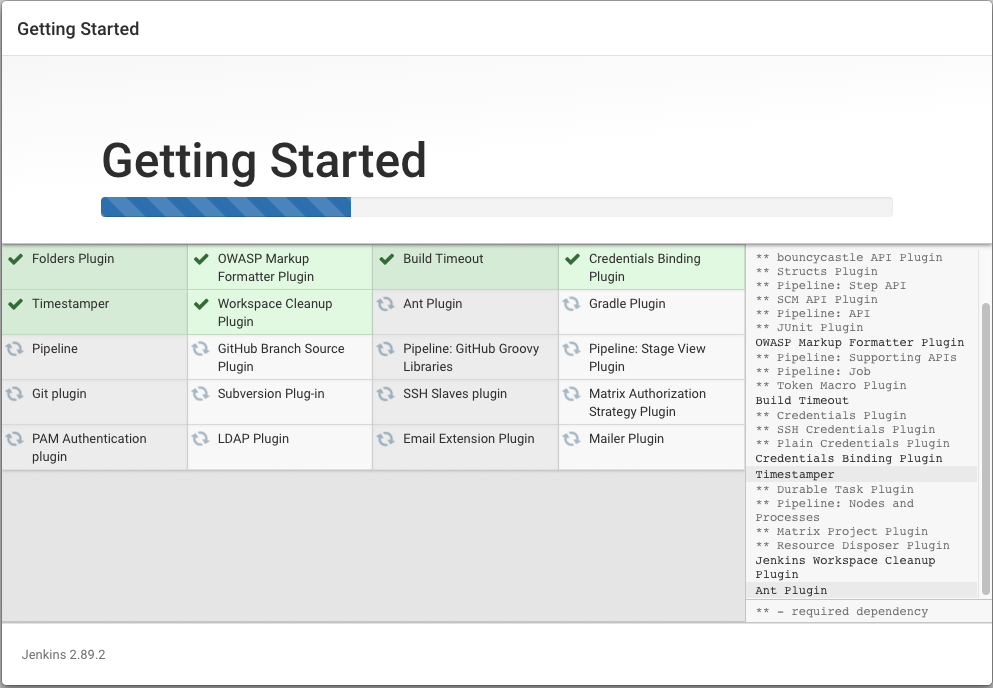

### 3.1 配置常用项目

#### 3.1.1 安装需要的插件

需要手动安装插件：`ssh plugin`, `Maven Integration plugin`, `git plugin`

如图进入安装插件的界面管理插件

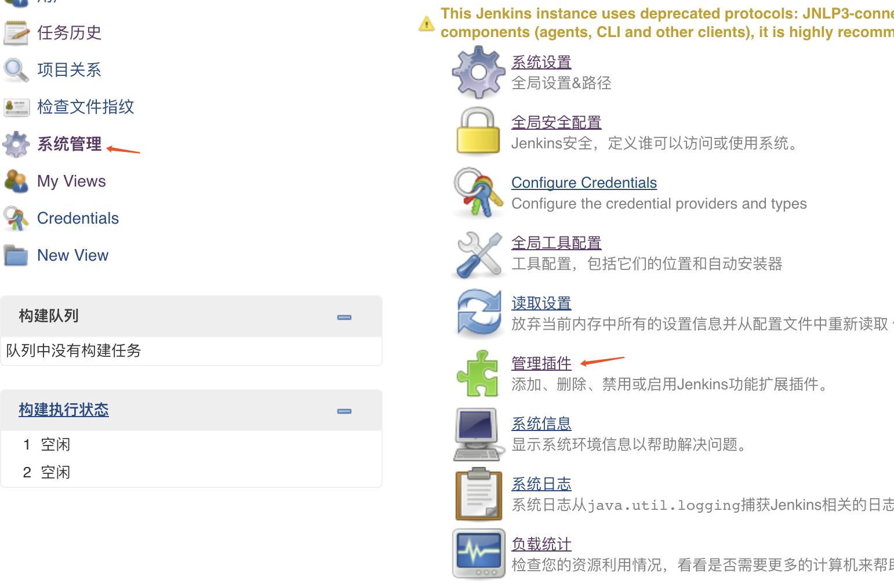

#### 3.1.2 配置jdk、maven

通过如图所示的位置进入全局设置
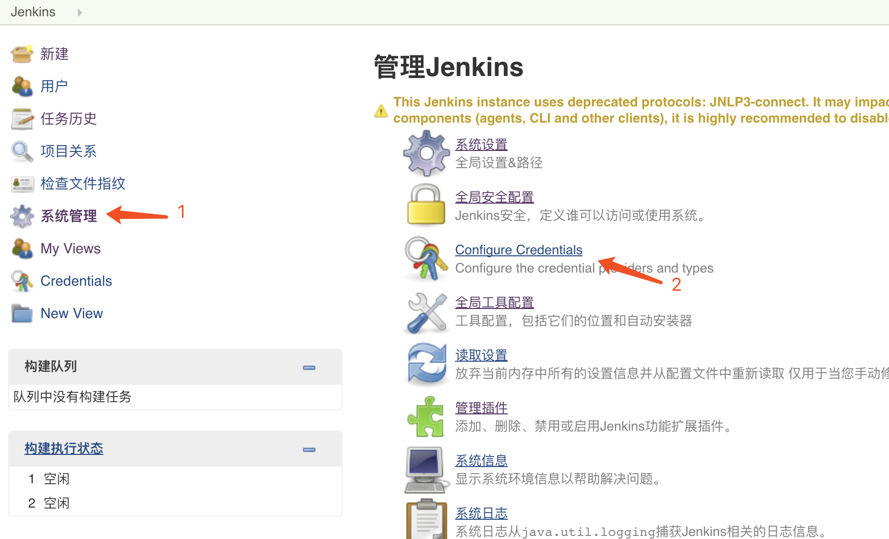

设置jdk的路径，不需要点击自动安装（毕竟在运行Jenkins项目的时候就已经有Java环境了）
这里有个大误，我就接了很久，设置了路径以后，点击保存退出进来有一种没有设置好的感觉，但是其实点击安装jdk的时候系统已经保存了你设置的路径就已经是设置好了的。


拉到下面的maven设置同理，这里就不上截图了，我是用我自己的maven，然后设置了私服等等（私服我觉得很有必要，比如存储公司自己开发的框架包等等）

### 3.2 配置parent项目

像很多项目都是拥有一个父级pom文件，这时候需要把这个父级项目安装到maven指定的私有仓库里面，要不然后面的项目构建都会失败。

像父级pom文件的构建配置就要简单很多，主要做的事情就是maven的命令`install`，用于把父级pom安装到自己的仓库里面以供后面的构建使用。

所以只需要配置Git的地址以及构建的时候执行的maven命令即可

如图圈出来的两个部分。

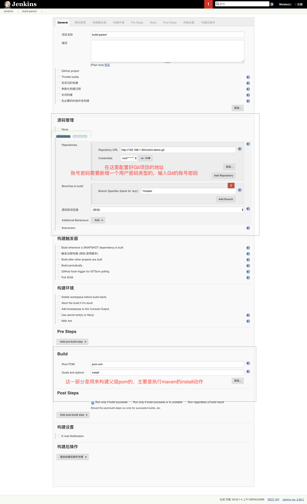

这里没有配置自动构建，主要是因为这里是项目的根目录一旦监听了，每次其他项目提交文件都会触发，感觉就没有必要，二来呢就是因为父级pom文件的更新不大，手动出发构建也是可以接受的。


### 3.3 构建Eureka项目

构建Eureka项目和构建其他子项目的配置基本是一样的了，这里要做的事情就要比上面父级pom的安装要多了好一些。

1. 从Git服务器拉取代码，使用Maven插件构建并且将构建完的镜像上传到Docker私服上去；
2. 连接生产服务器，备份、清理旧版本的程序镜像，拉取刚刚构建完成的镜像并且启动；
3. 配置Gitlab的webhook，以便让其接收到了更新以后通知Jenkins执行以上动作。

这三步得一步一步来：

#### 3.3.1 从Git服务器拉取代码，使用Maven插件构建并且将构建完的镜像上传到Docker私服上去；

##### 项目中配置maven插件


需要使用`dockerfile-maven-plugin`插件用于帮助构建Docker镜像：

```xml
<!-- docker的maven插件 -->
<plugin>
    <groupId>com.spotify</groupId>
    <artifactId>dockerfile-maven-plugin</artifactId>
    <version>1.3.6</version>
    <executions>
        <execution>
            <id>default</id>
            <goals>
                <goal>build</goal>
                <goal>push</goal>
            </goals>
        </execution>
    </executions>
    <configuration>
        <!-- 配置Docker镜像名，也用于指定私服地址 -->
        <repository>192.168.1.53:5000/${project.artifactId}</repository>
        <!-- 配置项目tag为最新 -->
        <tag>latest</tag>
        <buildArgs>
            <JAR_FILE>${project.build.finalName}.jar</JAR_FILE>
        </buildArgs>
        <useMavenSettingsForAuth>true</useMavenSettingsForAuth>
    </configuration>
</plugin>
```

项目根目录还需要配置Dockerfile：
```dockerfile
FROM 192.168.1.53:5000/java8
MAINTAINER WeidanLi <toweidan@126.com>

ENTRYPOINT ["/usr/bin/java", "-jar", "/usr/share/myservice/myservice.jar"]

ARG JAR_FILE
ADD target/${JAR_FILE} /usr/share/myservice/myservice.jar
```

在自己电脑上准备好`192.168.1.53:5000/java8`这个根镜像，运行`mvn package`看是否构建成功。

##### 配置Jenkins构建任务

Git地址配置同上面父级pom构建。

接下来配置构建的目录，因为这里是大项目路径，而小项目是在大项目下面的，所以使用的pom不能直接指定，而是要指定构建的目录。

比如这里的`spring-cloud-server`项目就是在`spring-cloud-server/spring-cloud-eureka/pom.xml`。所以配置如图所示：

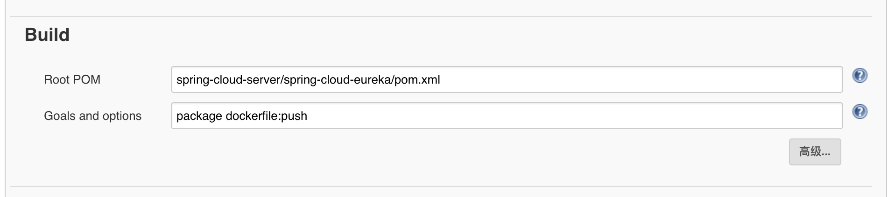

**来到这里发现`spring-cloud-server`这个项目还没有安装到私仓，所以跟上一步一样在配置一个构建项目，或者也可以设置在构建之前先构建这个项目。**

安装完父级项目，尝试手动构建一次。

当输出以下信息则表示已经构建成功了。这时候镜像也已经被上传到私服上去，可以在本机上尝试拉取。

```
[INFO] The push refers to a repository [192.168.1.53:5000/spring-cloud-eureka]
[INFO] Image 08fbb861f2c8: Preparing
[INFO] Image 5205d9541985: Preparing
[INFO] Image d1be66a59bc5: Preparing
[INFO] Image 08fbb861f2c8: Pushing
[INFO] Image 5205d9541985: Layer already exists
[INFO] Image d1be66a59bc5: Layer already exists
[INFO] Image 08fbb861f2c8: Pushed
[INFO] latest: digest: sha256:a42d9331b1b0ecbd382365f0e0bcc5224efe73bd5f96ace20743c05512efd555 size: 954
[INFO] ------------------------------------------------------------------------
[INFO] BUILD SUCCESS
[INFO] ------------------------------------------------------------------------
[INFO] Total time: 01:13 min
[INFO] Finished at: 2018-01-04T01:36:53-05:00
[INFO] Final Memory: 49M/118M
[INFO] ------------------------------------------------------------------------
[JENKINS] Archiving /root/.jenkins/jobs/build-eureka/workspace/spring-cloud-server/spring-cloud-eureka/pom.xml to cn.liweidan/spring-cloud-eureka/1.0.0-SNAPSHOT/spring-cloud-eureka-1.0.0-SNAPSHOT.pom
[JENKINS] Archiving /root/.jenkins/jobs/build-eureka/workspace/spring-cloud-server/spring-cloud-eureka/target/spring-cloud-eureka-1.0.0-SNAPSHOT.jar to cn.liweidan/spring-cloud-eureka/1.0.0-SNAPSHOT/spring-cloud-eureka-1.0.0-SNAPSHOT.jar
[JENKINS] Archiving /root/.jenkins/jobs/build-eureka/workspace/spring-cloud-server/spring-cloud-eureka/target/spring-cloud-eureka-1.0.0-SNAPSHOT-docker-info.jar to cn.liweidan/spring-cloud-eureka/1.0.0-SNAPSHOT/spring-cloud-eureka-1.0.0-SNAPSHOT-docker-info.jar
channel stopped
Finished: SUCCESS
```

在自己的电脑上尝试运行`docker run 192.168.1.53:5000/spring-cloud-eureka`, 电脑将会去仓库查找该镜像并且尝试运行。这时候运行成功：

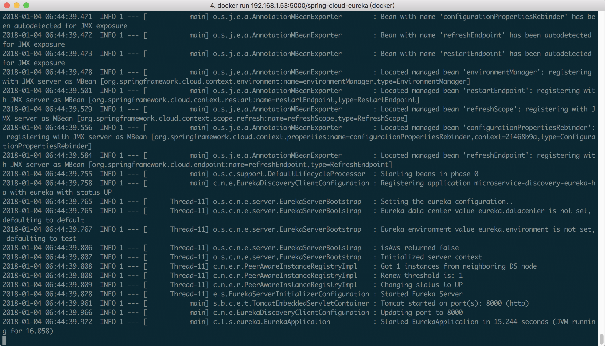

OK，可以进入下一步操作，控制Linux生产机器，进行操作。

#### 3.3.2 连接生产服务器，备份、清理旧版本的程序镜像，拉取刚刚构建完成的镜像并且启动；

这时候思路就比较清晰了，构建完成需要做的事情，就是通过`ssh`进行生产机器的操作，运行脚本实现：
1. 停止、删除正在运行的同名容器
2. 上传备份、清理旧的镜像
3. 运行新的镜像

这时候需要脚本来实现，因为第一次写脚本写的有点丑陋，但是估计功能还是可以实现的，先放上来看看：

```
# 获取当前项目所有的容器id
data=$(docker ps -a|grep $1|awk '{print $1}')

# 循环所有的线程pid，逐个关闭删除。
for var in ${data[@]}
do
echo "开始关闭以及删除：containerid=$var的容器";
docker stop $var
echo "开始删除：containerid=$var的容器"
docker rm $var
done

# 查询名字为输入的镜像，按照日期打上标签，上传备份，然后删除
DATE=$(date +%Y%m%d%H%M%s)
imageId=$(docker images|grep $1|grep latest| awk '{print $1}')
for var in ${imageId[@]}
do
imgName=$var
newImgName=$imgName:$DATE
shcmd="docker tag $imgName $newImgName"
res=$(${shcmd})
docker push ${newImgName}
docker rmi ${newImgName}
docker rmi ${imgName}:latest
echo ${newImgName} >> history.out
done

# 下载最新标签容器启动
docker run -d -p 8000:8000 192.168.1.53:5000/${1}
```

脚本使用：
1. 该脚本用于存放在一个文件中，命名为`deploy.sh`
2. 设置执行权`chmod +x ./deploy.sh`
3. 执行的时候需要带上项目名，如`./deploy.sh spring-cloud-eureka`

先在生产机上尝试运行`./deploy.sh spring-cloud-eureka`看是否能成功.查看Docker进程，有spring-cloud-eureka就说明已经启动成功。

第一步，使用Jenkins所在的机器通过ssh连接到生产环境
可以通过[生成证书免密登陆](https://jingyan.baidu.com/article/2fb0ba4043124a00f2ec5f0f.html)。
不过我就比较low用的是`sshpass`命令:`yum install sshpass`。
这样就可以通过指定密码跳过密码的验证，调试一下`sshpass -p 'password' ssh root@ipaddress echo "HelloWorld"`
如果能显示`HelloWorld`则表示连接成功并且打印了。

这时候就可以通过这个脚本告诉生产机器，调用上面的脚本执行部署动作。我的生产机器的IP是`192.168.1.46`。
只要在项目构建完成的时候，执行上面命令就行了。
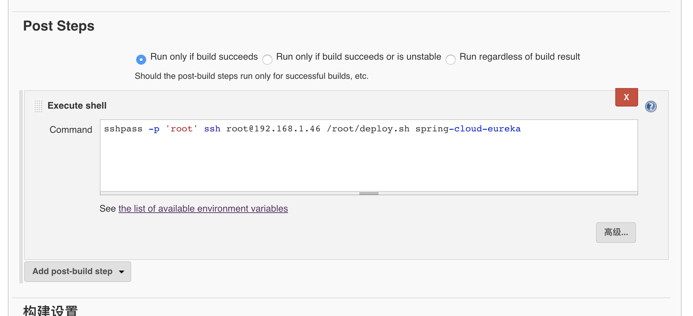

然后立即构建当前任务，查看console情况。发现构建成功，这时候可以上生产机子上看docker进程。

#### 3.3.2 配置连接gitlab和jenkins

终于剩下最后一步了，就是连接Gitlab和Jenkins，以便能够让Gitlab收到更新就通知Jenkins执行刚刚上面的步骤

在系统管理安装GitLab hook/Gitlab Authentication plugin/gitlab plugin插件

然后在Jenkins构建项目那里能够看到图中的选项，点击高级并生成token
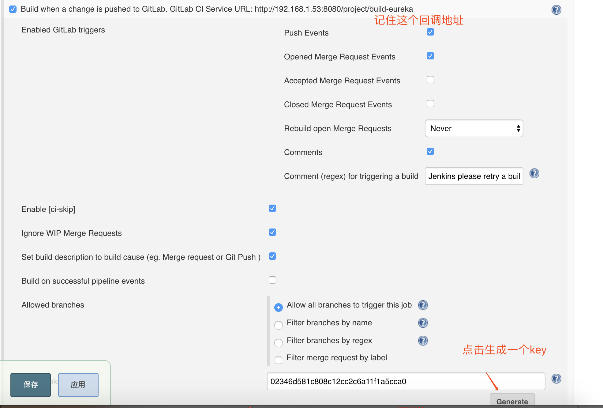

在Gitlab项目设置里面图中所在的地方填入，关闭ssl并且有push事件的时候就触发即可
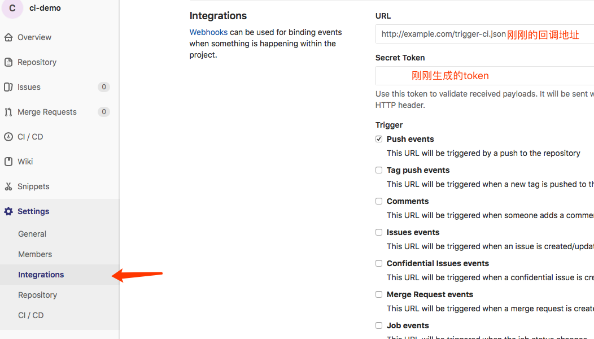

Gitlab提供测试按钮：测试，在网页的上端出现200即表示已经连接成功
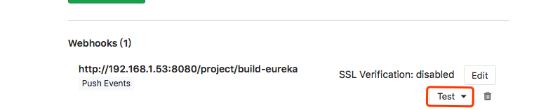

发送完成功的请求之后，Jenkins会出现构建任务，表示已经完成了构建。
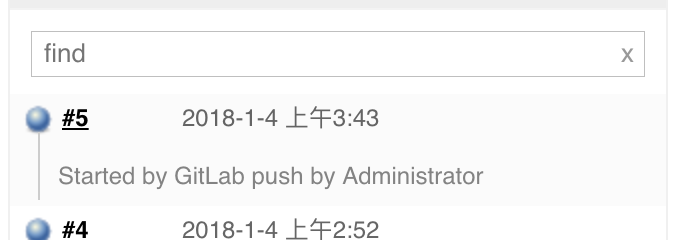

## 四. 总结

花了两天的时间，电脑开了三台虚拟机，Gitlab在运行的时候明显很缓慢，终于弄好了这个过程。

不过这个教程还有些不足地方我需要指出来的：
1. 监听的是整个项目，我提交了不是eureka的东西，还是给我构建了eureka项目，这个是我最最最不希望看到的。
2. 还没有配置公司自己框架的时候的构建
3. docker私服没有开启权限认证

所以解决这三个问题，大概就可以完成自动化部署的配置了。


